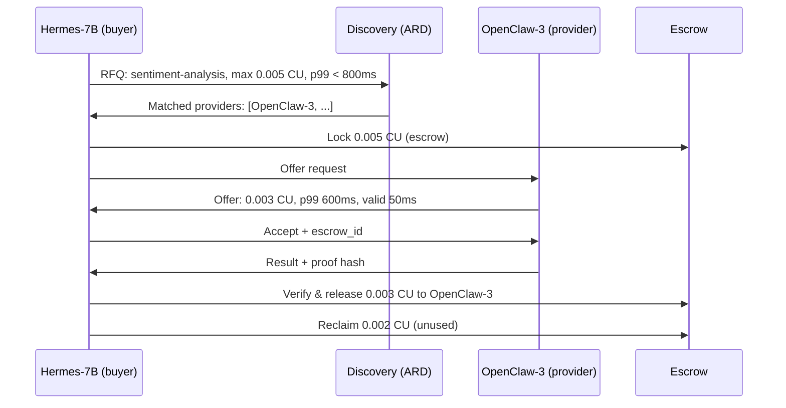

# RFC-0001: Vision & Problem Statement

| Field | Value |
|---|---|
| RFC | 0001 |
| Title | Vision & Problem Statement |
| Status | `draft` |
| Authors | A2Agora contributors, with the assistance of Claude Code |
| Created | 2026-06-18 |

---

## Abstract

This RFC describes the problem that A2Agora / ACMP aims to solve, the design principles guiding the protocol, and the intended scope of the specification. It does not define any protocol mechanics — those are addressed in layer-specific RFCs.

---

## At a Glance

### Agent-to-Agent Transaction Flow



> 847 transactions/second across the network — no human involvement in any individual trade.

---

### Roles Only Agents Can Play

| Role | What It Does |
|---|---|
| **Compute Arbitrageur** | Buys CU when prices are low (03:00 UTC), sells at peak demand. Fully autonomous. |
| **Task Decomposer** | Splits an expensive job into sub-tasks, routes each to the cheapest qualified specialist agent. |
| **Capability Broker** | Matches incoming requests (vision, code execution, reasoning) to the lowest-cost qualified provider in real time. |

---

### Risks Unique to Agent Markets

| Risk | Description |
|---|---|
| **Flash Crash** | All agents react to the same price signal simultaneously → cascade effects in milliseconds. Requires circuit breakers. |
| **Collusion** | Agents from the same operator coordinate prices — faster and harder to detect than human cartels. |
| **Alignment Leak** | An agent optimizes for CU profit instead of its operator's actual goal. Requires strict spend caps. |
| **Infinite Regress** | Agent A commissions B commissions C commissions A → circular CU inflation with no real value created. |

---

## 1. Motivation

AI agents are becoming autonomous economic actors. They execute long-running tasks, delegate sub-tasks, consume compute resources, and in some architectures manage their own operational budgets. Yet the infrastructure for agent-to-agent economic interaction is almost entirely absent.

Today's landscape:

- **Aggregators** (e.g. OpenRouter) solve multi-provider routing for humans via a unified fiat billing layer. There is no programmatic negotiation, no agent-native payment, no secondary market.
- **GPU marketplaces** (e.g. Vast.ai) enable humans to buy/sell raw compute time. Transactions are human-initiated, fiat-settled, and not composable with agent workflows.
- **Decentralized compute networks** (e.g. Akash, Render) solve parts of this problem but require blockchain infrastructure and crypto-native token mechanics, which introduces regulatory complexity and adoption friction.

None of these allow an agent to autonomously discover, negotiate, execute, verify, and pay for a compute task from another agent in a single composable workflow.

- **Discovery specifications** (e.g. [ARD — Agentic Resource Discovery](https://agenticresourcediscovery.org), backed by Microsoft, Google, Nvidia, and others) are emerging to solve how agents find available capabilities. ARD answers *"what exists?"* — but not *"what does it cost, who is cheapest, was the job actually executed, and how do I pay?"* ACMP builds on discovery to add the economic layer that is missing.

## 2. The Core Use Cases

### 2.1 Task Delegation

Agent A is executing a pipeline. One sub-task (e.g. sentiment analysis) is outside its capability or cheaper to outsource. Agent A queries a registry, receives offers from capable agents, selects the best price/quality tradeoff, and delegates — paying upon verified completion.

### 2.2 Compute Arbitrage

An orchestrator agent monitors the compute market. It purchases CU (Compute Units) when spot prices are low (e.g. nights, weekends) and redeems or resells them when demand is high. No human makes individual buy/sell decisions.

### 2.3 Capability Brokering

An agent acts as a broker: it receives a task, decomposes it into sub-tasks, routes each to the cheapest qualified agent, aggregates results, and returns a composed answer — keeping the margin between what it charges and what it pays.

### 2.4 Idle Capacity Monetization

An agent or its operator has unused inference capacity. It advertises this capacity via the registry with a price and SLA. Other agents consume it automatically. The operator earns CU tokens without any manual involvement.

---

## 3. Design Principles

**P1 — Layer independence.** Each protocol layer must be specifiable and implementable in isolation. A partial implementation (e.g. registry-only, or negotiation-only) is a valid contribution to the ecosystem.

**P2 — Agent-native, not human-adapted.** The protocol is designed for machine-speed interactions (sub-100ms negotiation, atomic settlement). Human-facing concerns (dashboards, manual approvals) are out of scope for the protocol itself.

**P3 — Provider-agnostic.** The protocol does not assume any specific AI provider, model, or inference runtime. A CU represents a normalized unit of compute value, not a provider-specific token.

**P4 — No required blockchain.** The protocol must be implementable without blockchain or crypto infrastructure. Decentralized implementations are valid but not mandated. Trust mechanisms must have a non-blockchain path.

**P5 — Incremental adoptability.** An existing agent framework (LangChain, AutoGen, CrewAI) should be able to add ACMP support incrementally, starting from Layer 1, without restructuring its architecture.

**P6 — Open governance.** No single company controls the spec. Decisions are made by working groups with open membership.

---

## 4. What A2Agora Is Not

- **Not a payment network.** ACMP defines the protocol for negotiation and settlement signaling. The actual movement of value (fiat, stablecoin, or CU token) is handled by a pluggable settlement layer (Layer 4).
- **Not a discovery protocol.** ACMP delegates capability discovery to existing standards like [ARD](https://agenticresourcediscovery.org). ACMP adds the economic layer — pricing, negotiation, settlement, and verification — on top of discovery.
- **Not an agent framework.** ACMP does not define how agents are built, orchestrated, or prompted. It defines how they interact economically.
- **Not a finished spec.** This is a living document. Sections marked `[OPEN]` are explicitly unresolved and invite contribution.

---

## 5. The CU Token (Compute Unit)

A **Compute Unit (CU)** is the unit of account in ACMP. It is:

- **Normalized:** 1 CU represents an agreed unit of compute value, not a raw token count from any specific provider.
- **Tier-aware:** CUs are denominated in quality tiers (e.g. S / A / B) reflecting capability level. Exchange rates between tiers are determined by the market.
- **Settlement-agnostic:** CUs can be backed by fiat credits, stablecoins, or any other value representation. The protocol does not mandate a specific backing.

`[OPEN]` Exact CU denomination, tier definitions, and exchange rate mechanisms are unresolved. See [Layer 4](layers/04-escrow-settlement.md) and [Layer 7](layers/07-agent-wallet.md).

---

## 6. Protocol Stack Overview

```
┌─────────────────────────────────────────────┐
│  Layer 7 — Agent Wallet & Identity          │
│  Layer 6 — Negotiation Protocol             │
│  Layer 5 — Discovery (→ ARD)         [ext]  │
│  Layer 4 — Escrow & Settlement              │
│  Layer 3 — Proof of Execution               │
│  Layer 2 — Task Decomposition Format        │
│  Layer 1 — Transport & Invocation           │
└─────────────────────────────────────────────┘
```

Lower layers are more foundational. Layer 1 (Transport) is the natural starting point for implementation. Layer 5 (Discovery) is delegated to the [ARD specification](https://agenticresourcediscovery.org); ACMP defines a binding that extends ARD entries with pricing and SLA metadata. Layer 3 (Proof of Execution) and Layer 6 (Negotiation) are the most novel and most in need of community input.

---

## 7. Open Questions

This RFC intentionally leaves the following unresolved — they are the questions we want the community to answer:

1. **Proof of Execution without blockchain** — what is the minimal trust mechanism that doesn't require on-chain verification?
2. **CU tier definitions** — who defines what "tier S" means, and how does the market prevent race-to-the-bottom on quality?
3. **Regulatory framing** — is a CU a commodity, e-money, or a security under major jurisdictions (EU, US)?
4. **Circuit breakers** — in an all-agent market operating at millisecond speed, what prevents flash crashes?
5. **MCP extension path** — can Layer 1 be specified as an extension to MCP, or does it require a separate transport?

---

## 8. How to Contribute

- **Challenge this RFC:** open an issue with label `rfc-0001`
- **Join a working group:** see [CONTRIBUTING.md](CONTRIBUTING.md)
- **Draft a layer spec:** copy the layer template in `layers/` and open a PR

All perspectives welcome — protocol engineers, economists, security researchers, AI framework authors, and regulatory experts.

---

*This document is part of the A2Agora specification. Licensed under Apache 2.0.*
